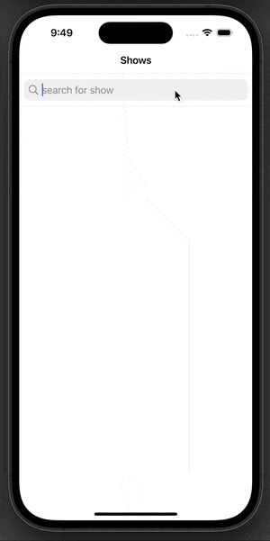

# TV Show Finder
Users are able to search for tv shows as well as explore the show's episodes if avaiable.

## Code Elements 
- Season section headers

<details>
<summary>Code</summary>

``` Swift
private func getSeasonSections() {
        let sortedEpisodes = episodes.sorted { $0.season < $1.season }
        let uniqueSeasons = Set(sortedEpisodes.map { $0.season })
        var sections = Array(repeating: [Episode](), count: uniqueSeasons.count)
        var currentIndex = 0
        var currentSeason = sortedEpisodes.first?.season ?? 0
        
        for episode in sortedEpisodes {
            if episode.season == currentSeason {
                sections[currentIndex].append(episode)
            } else {
                currentIndex += 1
                currentSeason = episode.season
                sections[currentIndex].append(episode)
            }
        }
        seasonSections = sections
    }
```
</details>
    
- Custom cells
- Network helper (a singleton class wrapped around URLSession)
- HTTP Get Request with tvmaze API
- JSON Decoding 




## Future improvements - addtions 
- Make updates to the ui/ux
- Add ability to favotite shows & episodes 
